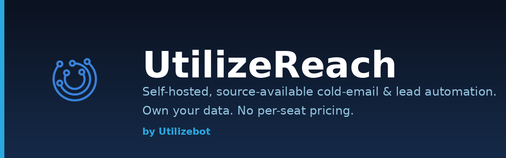
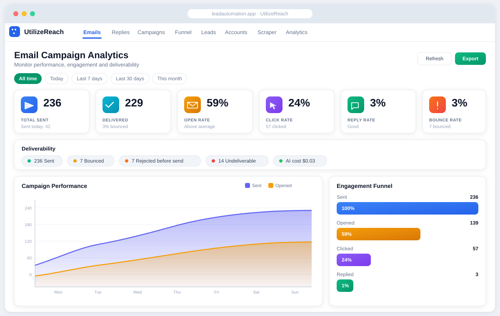
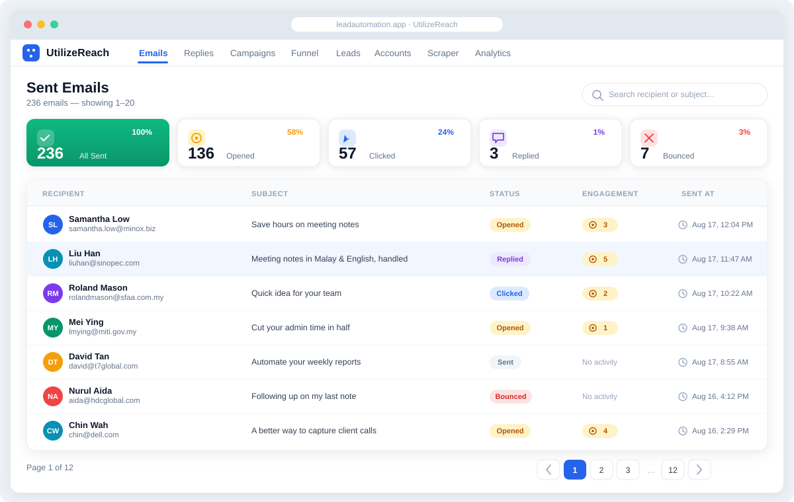
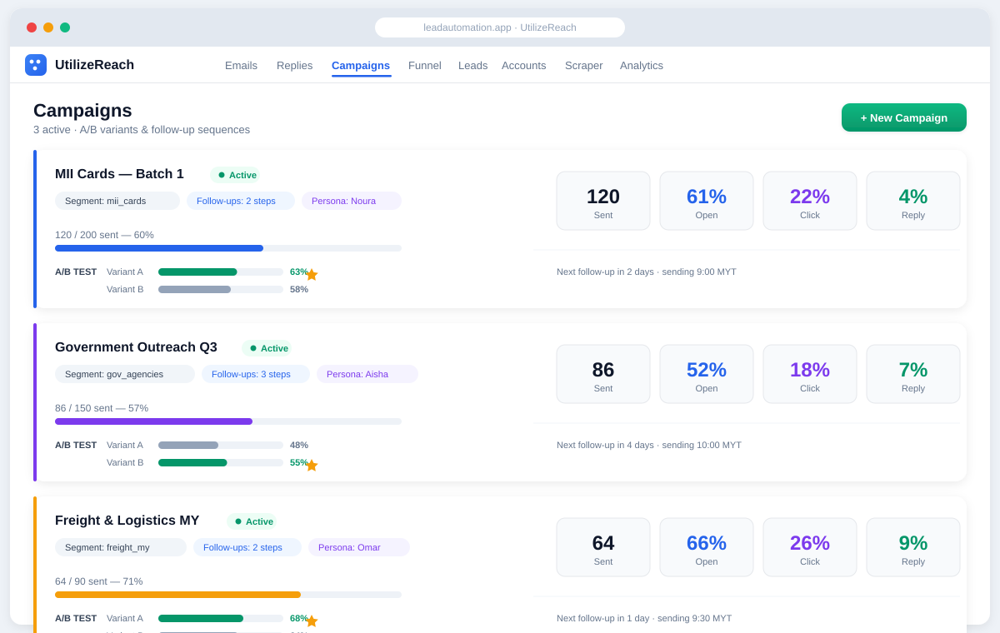
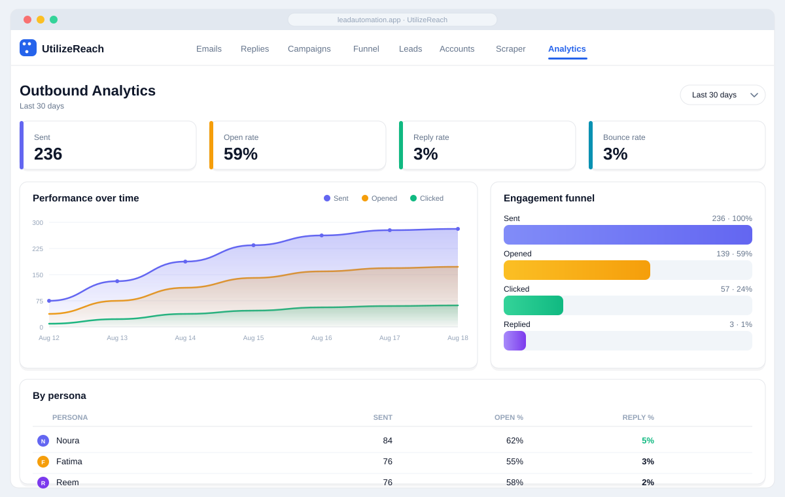

<p align="center">
  
</p>

# UtilizeReach

[](./LICENSE)
[](https://github.com/Utilizebot/utilizereach/stargazers)
[](#contributing)
[](https://fastapi.tiangolo.com/)
[](https://react.dev/)
[](https://docs.docker.com/compose/)

**By [Utilizebot](https://github.com/Utilizebot).** A self-hosted platform for
AI-assisted lead capture and cold-email outreach — scrape and import leads,
segment them, generate personalized emails with an LLM, send them from multiple
sender identities at a safe warm-up pace, and track opens / clicks / replies /
bounces in a real-time dashboard.

> **License:** [PolyForm Noncommercial 1.0.0](./LICENSE) (source-available).
> **Noncommercial use is free** (personal, research, evaluation, education,
> nonprofits, government). **Any commercial use requires a separate commercial
> license from Utilizebot** — see
> [Commercial license & managed hosting](#-commercial-license--managed-hosting)
> below. This is a source-available license, not an OSI "open source" license.

## Screenshots

<!-- UI previews rendered from the product design — swap in live screenshots / a demo GIF anytime -->

| | |
|---|---|
| <br/>**Dashboard** — deliverability & engagement at a glance | <br/>**AI emails** — per-recipient personalized drafts |
| <br/>**Campaigns** — A/B variants & follow-up sequences | <br/>**Analytics** — per-persona / segment / campaign |

> A look inside UtilizeReach. A live interactive demo is coming — ⭐ **star the repo** to get notified.

## Why UtilizeReach

- **Own your data / self-host.** Leads, mailboxes, and analytics stay on your
  server — nothing routed through a third-party SaaS.
- **No per-seat pricing.** Add users, personas, and mailboxes without a bill that
  scales with your headcount.
- **Source-available.** Read, audit, and modify the whole stack — no black box.
- **One stack, end to end.** Scrape → segment → generate → send → track →
  analyze, without stitching together four tools.
- **LLM-agnostic.** Bring Claude, Gemini, OpenAI, or any OpenAI-compatible
  endpoint (Ollama, self-hosted) — swap providers from Settings.

## Features

- **Lead capture & import** — config-driven public form, CSV/Excel import, and a
  flexible scraper.
- **Segments** — organize leads into modular, filterable segments.
- **AI email generation** — per-recipient personalized emails via your configured
  LLM provider (Claude, Gemini, OpenAI, or any OpenAI-compatible endpoint).
- **Multi-persona sending** — send from several verified sender identities
  (Gmail send-as aliases) with per-persona tone.
- **Warm-up sender** — paced outbound (configurable daily cap and per-send delay,
  business-hours window) with an optional automatic ramp, so new domains don't
  burst.
- **Campaigns + A/B** — targeted campaigns with A/B variants and follow-up
  sequences to non-repliers.
- **Tracking** — open pixel, click tracking, thread-based reply detection, and
  automatic bounce quarantine. Bounce-exclusive engagement so undelivered mail
  never counts as opened/clicked.
- **Analytics** — period-aware dashboard: deliverability, engagement funnel,
  per-persona / per-segment / per-campaign breakdowns.
- **Compliance** — one-click unsubscribe endpoint and exclusion lists.

## Stack

| Layer     | Tech |
|-----------|------|
| Backend   | FastAPI (Python 3.12) |
| Frontend  | React 19 + TypeScript + Vite + Tailwind |
| Database  | PostgreSQL 16 |
| Queue     | Redis + Celery |
| Delivery  | Docker Compose |
| Email     | Gmail API (send-as aliases) |

## An open-source alternative to Instantly, Lemlist, Smartlead & Apollo

Instantly, Lemlist, Smartlead, and Apollo are polished, well-supported managed
SaaS products — if you want a hosted tool and don't mind cloud pricing, they're
great. UtilizeReach competes on a different axis: **self-hosting, data
ownership, and pricing model.** Feature-wise the outreach engine is comparable;
where UtilizeReach differs is that you run it on your own server and own every
row.

| | **UtilizeReach** | Instantly / Lemlist / Smartlead / Apollo |
|---|:---:|:---:|
| Self-hosted | ✅ | ❌ (cloud SaaS) |
| Own your data / on-prem | ✅ | ❌ (data on their cloud) |
| Source-available code | ✅ | ❌ (proprietary) |
| Pricing model | Free noncommercial · commercial license for business use | Paid SaaS, per seat |
| Multi-inbox / sender personas | ✅ | ✅ |
| Warm-up pacing | ✅ | ✅ |
| A/B + follow-up sequences | ✅ | ✅ |
| Open / click / reply tracking | ✅ | ✅ |
| AI email generation | ✅ (bring your own LLM) | ✅ |
| Built-in lead scraper | ✅ | ✅ (varies by product) |
| Unsubscribe + compliance tooling | ✅ | ✅ |

The takeaway isn't "they can't track or warm up" — they can. It's that with
UtilizeReach **the whole stack runs on infrastructure you control, with no
per-seat bill.**

## Quick start

```bash
git clone https://github.com/Utilizebot/utilizereach.git
cd utilizereach

# 1. Copy and fill in environment variables
cp .env.example .env
cp backend/.env.example backend/.env        # set JWT_SECRET, DB creds, LLM key, Google OAuth

# 2. Bring up the stack
docker compose up -d --build

# 3. Open the app and complete the Setup Wizard
#    (system check -> admin account -> API keys -> company branding)
open http://localhost:3000
```

The first unauthenticated account you register becomes the admin.

## Connecting email (Gmail) — read this first

Sending runs on the **Gmail API** with OAuth (no SMTP passwords stored). You create a
Google Cloud OAuth client, drop the ID/secret in `.env`, then click **Connect Google
account** in the app. Each account can send from multiple **send-as aliases** used as
personas.

👉 **Full step-by-step guide: [docs/EMAIL_SETUP.md](./docs/EMAIL_SETUP.md)** — Google Cloud
project, enabling the Gmail API, OAuth consent screen (incl. the 7-day test-mode token
caveat), the exact redirect URI, connecting accounts, setting up personas, deliverability
(SPF/DKIM/DMARC), and troubleshooting (`redirect_uri_mismatch`, unverified-app, etc.).

Quick version:
```env
# .env
GOOGLE_CLIENT_ID=xxxx.apps.googleusercontent.com
GOOGLE_CLIENT_SECRET=xxxx
PUBLIC_BASE_URL=http://localhost:8000     # must match the redirect URI host in Google Cloud
```
Authorized redirect URI to register in Google Cloud:
`<PUBLIC_BASE_URL>/api/email-accounts/google/callback` — then `docker compose restart backend`
and connect under **Email Accounts**.

## Configuration

- **Branding** — set your company name, logo, colors, and form copy in the Setup
  Wizard (persisted to `config.json`); no code changes needed.
- **LLM provider** — Settings → Email AI. Supports `claude`, `gemini`, `openai`,
  or `custom` (any OpenAI-compatible `base_url`, e.g. Ollama/self-hosted).
- **Sending / warm-up** — after connecting Gmail (above), the paced warm-up sender runs
  from `ops/smart_sender.py` (schedule with cron); reply + bounce handling from
  `ops/reply_handler.py` and `ops/bounce_handler.py`.

## 💼 Commercial license & managed hosting

**Noncommercial use is free** — personal, research, evaluation, education,
nonprofits, and government use are covered by the
[PolyForm Noncommercial 1.0.0](./LICENSE) license at no cost.

**Commercial, business, or production use requires a commercial license from
Utilizebot** — this includes running outreach for a business, offering
UtilizeReach (or a derivative) as a hosted/managed service, or any use for
commercial advantage.

**A hosted / managed version is available** if you'd rather not run the
infrastructure yourself. Join the waitlist or request a commercial license by:

- Opening an issue on this repository, or
- Reaching the Utilizebot org at <https://github.com/Utilizebot>.

## Security notes

- All secrets live in `.env` files (git-ignored). Do not commit `.env`, OAuth
  client secrets, `*.lic`, or token files.
- The public tracking/form endpoints should be rate-limited behind your reverse
  proxy before production use.
- You are responsible for complying with anti-spam and data-protection law
  (CAN-SPAM, GDPR, PDPA, etc.) in the jurisdictions you email into. UtilizeReach
  ships one-click unsubscribe, exclusion lists, automatic bounce handling, and
  warm-up pacing to support **legitimate, permission-based** outreach — consent
  is your responsibility.

## Contributing

Issues and PRs are welcome. By contributing you agree your contributions are
licensed under the repository's license. Note the commercial-use restriction
above.

## License

Commercial or production use — running outreach for a business, offering it (or
a derivative) as a hosted/managed service, or any use for commercial advantage —
requires a commercial license from **Utilizebot**. To request one, open an issue
on this repository or contact Utilizebot via <https://github.com/Utilizebot>.
See [Commercial license & managed hosting](#-commercial-license--managed-hosting)
for details, and [LICENSE](./LICENSE) for the full PolyForm Noncommercial 1.0.0
text.
